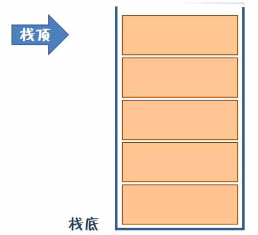
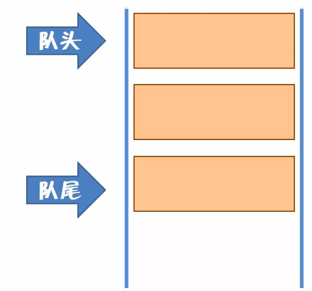
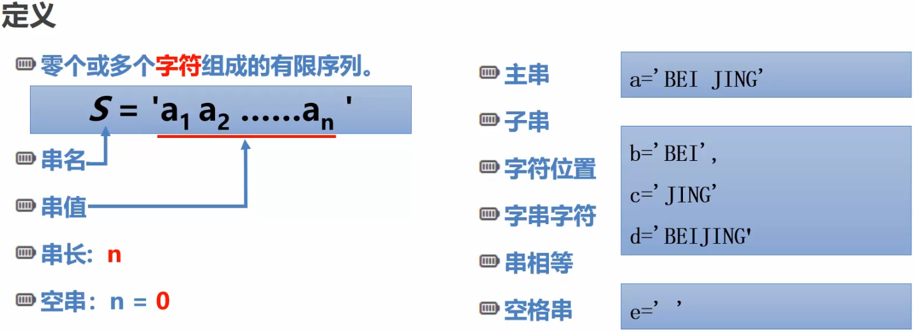
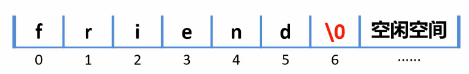
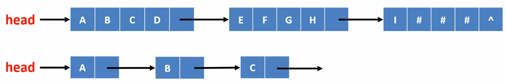
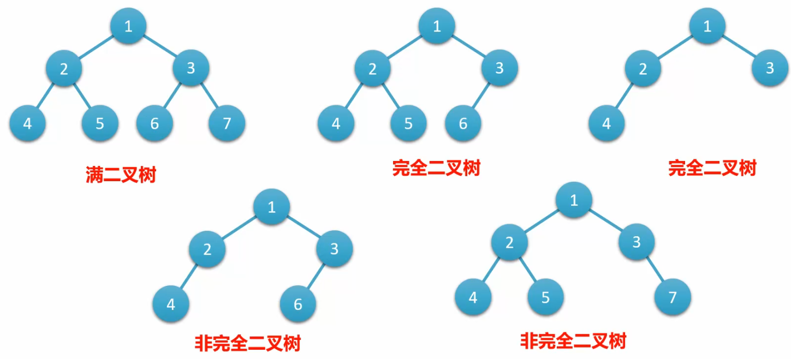
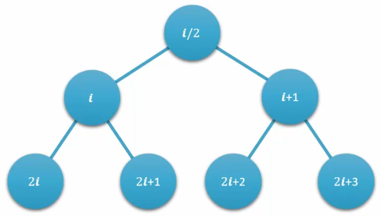
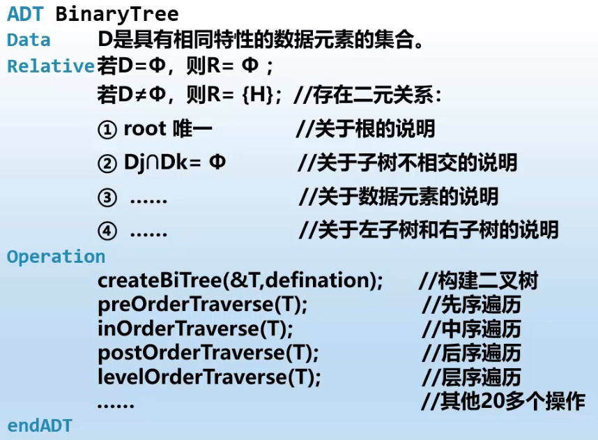

# 

# 栈
> 什么是栈？

栈(Stack)是限定仅在表尾插入和删除操作的线性表
- **允许插入和删除的一端成为栈顶(top),另一端称为栈底(bottom)**
- **不含任何数据元素的栈称为空栈**

特点：
- **先进后出**
- **后进先出，简称LIFO结构**
- **栈的插入操作，称为进栈，也成为压栈、入栈(push)**
- **栈的删除操作，称为出栈，也成为弹栈(pop)**

<br/>

> 栈中的抽象数据类型

```c
ADT 栈(Stack)
Data
    栈的数据集合为{a1,a2,a3,...an}，每个元素的类型均为DataType。其中，除第一个元素a1外，每隔元素有且只有一个直接前驱元素，除了最后一个元素an外，
每个元素有且只有一个直接后继元素。数据元素之间的关系是一对一的关系。
Operation
    initStack(*S)：      初始化操作，建立一个空栈S。
    destoryStack(*S)：   若栈存在，则销毁它。
    stackEmpty(S)：      若栈为空，返回为true，否则返回false。
    clearStack(*S)：     将栈清空。
    getTop(S,*e)：       若栈存在，插入新元素e到栈S中并称为栈顶元素。
    Push(*S,e)：         若栈S存在，插入新元素e到栈S中并称为栈顶元素。
    pop(*S,*e)：         删除栈S中的栈顶元素，并用e返回其值
    stackLength(L)：     返回栈S中的元素个数
endADT
```
## 栈的顺序存储结构
### 栈的结构定义
```c
/* 定义栈的顺序存储结构 */
typedef struct SeqStack{
    ElementType elements[MAX_SIZE];//顺序栈中用来存放数据元素的数组
    int top;  //栈顶(数组中的下标)，如果为-1则证明栈为空
    int length; //当前栈的元素个数
}SeqStack;
```
```c
/* 定义数据元素*/
typedef struct {

    int id;
    char * name;

}ElementType;
```
### 栈中的方法 

> 初始化栈
```c
void InitSeqStack(SeqStack * seqStack){
    seqStack->top = -1;//栈顶指向-1的下标
    seqStack->length = 0; //
}
```
> 向栈中压入元素，返回压入的结果
```c
int PushSeqStack(SeqStack * seqStack,ElementType element){
    if (seqStack->top == MAX_SIZE - 1)
    {
        printf("满栈，压入失败");
        return FALSE;
    }
    seqStack->top++; //栈顶指针+1，以便加入新的元素
    //将新插入的元素赋值给栈顶
    seqStack->elements[seqStack->top] = element;
    seqStack->length++;
}

```
> 以指针方式返回出栈的元素，返回值为出栈的结果(true/false)
```c
int PopSeqStack(SeqStack *seqStack,ElementType *element){
    if (seqStack->top == -1)
    {
        printf("空栈，出栈失败");
        return FALSE;
    }
    //返回栈顶指向的元素
    *element = seqStack->elements[seqStack->top];
    seqStack->top--;
    seqStack->length--;
    return TRUE;
}
```
> 清空栈
```c
void ClearSeqStack(SeqStack * seqStack){
    seqStack->top = -1;
    seqStack->length = 0;
}
```
> 返回栈顶元素
```c
void GetTopElement(SeqStack * seqStack,ElementType *element){
    if (seqStack->top == -1){
        printf("空栈，栈顶元素为空！");
        element = NULL;
        return;
    }
    *element = seqStack->elements[seqStack->top];
}
```
## 栈的链式存储结构
> 特点
- **链栈的结构与链表相似**
- **插入与删除等操作都在链表的头部**
- **链表是一个以top为头结点，从栈顶指向栈底的单链表**

### 栈的结构定义
```c
/* 链栈的结点 */
typedef struct StackNode{
    ElementType data;       // 结点中保存的元素
    struct StackNode * next;// 指向下个结点的指针
}StackNode;
```
```c
/* 链栈结构 */
typedef struct LinkedStack
{
    StackNode * top;
    int length;
}LinkedStack;
```
```c
typedef struct {

    int id;
    char * name;

}ElementType;
```
### 栈中的方法
> 初始化栈结构
```c
void InitLinkedStack(LinkedStack * linkedStack){
    linkedStack->top = NULL;
    linkedStack->length = 0;
}
```

> 压栈并返回结果
```c
int PushLinkedStack(LinkedStack * linkedStack,ElementType  element){
    //创建一个新结点
    StackNode * newNode = (StackNode *)malloc(sizeof(StackNode));
    newNode->data = element; //将element数据项赋值给新结点 
    newNode->next = linkedStack->top;//新的结点赋值给当前的栈顶
    linkedStack->top = newNode;//当前的栈顶指向新节点
    linkedStack->length++;
    return TRUE;
}
```
> 弹栈并返回结果 
```c
int PopLinkedStack(LinkedStack * linkedStack,ElementType * element){
    if (linkedStack->top = NULL)
    {
        printf("空栈，出栈操作失败！\n");
        return FALSE;
    }
    //返回栈顶元素
    *element = linkedStack->top->data;
    //记录出栈操作前的栈顶指针
    StackNode * node = linkedStack->top;
    //栈顶指针下移一位
    linkedStack->top = linkedStack->top->next;
    //释放掉原栈顶空间
    free(node);
    linkedStack->length--;
    return TRUE;
}
```
> 清空栈-遍历栈中的每个元素并释放结点空间
```c
void ClearLinkedStack(LinkedStack * linkStack){
    StackNode * tempNode;
    while (linkStack->top)
    {
        tempNode = linkStack->top;
        linkStack->top = linkStack->top->next;
        free(tempNode);
        linkStack->length--;
    }
}
```
> 销毁栈 
```c
void DestroyLinkedStack(LinkedStack *linkedStack){
    //先清空栈中的结点
    ClearLinkedStack(linkedStack);
    //再清空栈
    free(linkedStack);
    linkedStack = NULL;
}
```
** **
# 队列
> 什么是队列
- **队列(Queue)是只允许在一端进行插入操作，而在另一端进行删除操作的线性表**
- **队列是一种先进先出的线性表**
- **允许插入的一端称为队尾，允许删除的一端称为队头**
> 特点
- **先进先出**
- **后进后出**
- **队列是受到操作限制的线性表**
<br/>


> 队列中的抽象数据类型

```c
ADT 队列(Queue)
Data
    栈的数据集合为{a1,a2,a3,...an}，每个元素的类型均为DataType。其中，除第一个元素a1外，每隔元素有且只有一个直接前驱元素，除了最后一个元素an外，每个元素有且只有一个直接后继元素。数据元素之间的关系是一对一的关系。
Operation
    initQueue(*S)：      初始化操作，建立一个空栈Q。
    destoryQueue(*S)：   若栈存在，则销毁它。
    queueEmpty(Q)：      若队列为空，返回true,否则返回false。
    clearQueue(S)：      将队列清空。
    getHead(*S)：        若队列Q存在且非空，用e返回Q的队头元素
    insert(S,*e)：       若队列Q存在，插入新元素e到队列Q中并称为队尾元素
    delete(*S,e)：       删除队列Q中的队头元素，并用e返回其值
    queueLength(*S,*e)： 返回队列Q的元素个数
endADT
```
** **
## 循环队列
> 特点
- **数组未满时都可以插入新的队尾元素**
- **循环队列就是队列头尾相接的顺序存储结构**

### 循环队列中的结构定义
> 起别名
```c
#define STATE_OK 1
#define STATE_FAILD - 1
typedef int State; //给整形起一个别名，专门用来表示状态
```
```c
/* 循环队列结构 */
typedef struct{
    ElementType data[MAX_SIZE];
    int front; //队头指针
    int rear;  //队尾指针
    int length; //队列长度
    //也可以在这里增加标识位，标识当前队列是否已满    
}SeqQueue;
```
```c
typedef struct {
    int id;
    char * name;
}ElementType;

```

### 循环队列中的方法
> 初始化队列结构
```c
    /* 初始化 */
    void InitSeqQueue(SeqQueue * seqQueue){
        if (seqQueue == NULL){
            seqQueue == (SeqQueue *)malloc(sizeof(SeqQueue));
        }
        seqQueue->length = 0;
        seqQueue->front = 0;
        seqQueue->rear = 0;
    }
```
> 以TRUE/FALSE的方式返回传入的队列是否为空
```c
    State IsSeqQueueEmpty(SeqQueue * seqQueue){
        //队头指针如果与队尾指针相同，队列为空
        return seqQueue->front == seqQueue->rear ? TRUE : FALSE;
    }
```
> 判断队列是否为满
```c
    State IsSeqQueueFull(SeqQueue * seqQueue){
        if ((seqQueue->rear + 1) % MAX_SIZE == seqQueue->front)
        {
            return TRUE;
        }
        return FALSE;
    }
```
> 入队
```c
    State OfferSeqQueue(SeqQueue * seqQueue,ElementType element){
        if (IsSeqQueueFull(seqQueue)){
            return STATE_FAILD; // 队列已满，入队失败
        }
        seqQueue->data[seqQueue->rear] = element;
        seqQueue->rear = (seqQueue->rear + 1) % MAX_SIZE;
        seqQueue->length++;
        return STATE_OK;
    }
```
> 出队
```c
    State PollSeqQueue(SeqQueue * seqQueue,ElementType * element){
        if (IsSeqQueueEmpty(seqQueue)){
            return STATE_FAILD;
        }
        //取出队头元素
        *element = seqQueue->data[seqQueue->front];
        seqQueue->front = (seqQueue->front + 1) % MAX_SIZE; //取模MAX_SIZE
        seqQueue->length--;  
        return STATE_OK;
    }
```
# 串

> 定义



> c语言中常用的串运算

```c
    #include<string.h> //标准库函数
    strcmp(char s1,char s2)//串比较
    strcpy(char to,char from)//串复制
    strcat(char to,char from)//串连接 
    strlen(char s)//求串长

```
## 串的抽象数据类型
```c
ADT String
Data
    串中元素仅由一个字符组成，相邻元素具有前驱和后继元素
Operation
    StrAssign(T,*chars) //生成一个其值等于字符串常量chars的串T
    StrCopy(T,S) //串S存在，由串S复制得串T
    ClearString(S) //串S存在，将串清空
    StringEmpty(S) //若串S为空，返回true，否则返回false
    StrLength(S) //返回串S的元素个数，即串的长度
    StrCompare(S,T) //若S>T,返回值>0，若S=T，返回0，若S < T,返回值为<0
    Concat(T,S1,S2) //用T返回S1和S2联接而成的新串
    SubString(Sub,S,pos,len) //用Sub返回串S的第pos个字符起长度为len的子串
    Index(S,T,pos) //若主串S中存在和串T值相同的子串，则返回它在主串S中第pos个字符后第一次出现的位置
    Replace(S,T,V) //用V替换主串S中出现的所有与T相等的不重叠子串
    StrInsert(S,pos,T) //在串S的第pos个字符之前插入串T
    StrDelete(S,pos,len)//从串S中  删除第pos个字符起长度为len的子串
EndADT 
```
## 顺序串
### 串的顺序存储结构
> 串的顺序存储结构是用一组地址连续的存储单元来存储串中的字符序列的

**存储结构示意图如下：**
> 注意：“\0”用来表示串值的终结，计算串值长度时不计



### 串的顺序结构定义
```c
typedef struct sqString{
    char *ch; //若串非空，则按串长分配存储区，否则ch为NULL
    int length; //串长度
}
```
### 串中的方法
> 初始化堆字符串
```c
    void InitString_HeapString(HString * str){
        str->ch = NULL;
        str->length = 0;
    }
```

> 为串str赋值，值为字符串常量chars
```c
    Status StrAssign_HeapString(HString * str,char * chars){
        int len = strlen(chars);
        if (!len)
        {
            return ERROR;
        }
        InitString_HeapString(str);  
        str->ch = (char *)malloc(len * sizeof(char));
        if (!str->ch)
        {
            exit(OVERFLOW);
        }
        for (int i = 0; i < len; i++)
        {
            str->ch[i] = chars[i];
        }
        str->length = len;
        return OK;
    }
```
> 打印堆字符串
```c
    void PrintHeapString(HString * str){
        if (str->length == 0 || !str->ch)
        {
            printf("堆字符串为空！\n");
            return;
        }
        for (int i = 0; i < str->length; i++)
        {
            printf("%c",str->ch[i]);
        }
        printf("\n");
    }
```
> 将串srcStr中的内容复制到串destStr中
```c
    Status StrCopy_HeapString(HString * destStr,HString * srcStr){
        InitString_HeapString(destStr);
        if (IsEmpty_HeapString(srcStr)){
            printf("要复制的字符串值srcStr不能为空");
            return ERROR;
        }
        destStr->ch = (char*)malloc(sizeof(char)*srcStr->length);
        if (!destStr->ch){
            exit(OVERFLOW);
        }
        for (int i = 0; i < srcStr->length; i++){
            destStr->ch[i] = srcStr->ch[i];
        }
        destStr->length = srcStr->length;
        return OK;
    }
```
> 判断当前字符串是否为空
```c
    Status IsEmpty_HeapString(HString * str){
        if (str->length == 0 || !str->ch)
        {
            return TRUE;
        }
        return FALSE;
    }

```
> 连接两个串，连接的结果以串destStr返回
```c
    Status Concat_HeapString(HString * destStr,HString * str1,HString * str2){
        InitString_HeapString(destStr);
        destStr->length = str1->length + str2->length;
        destStr->ch=(char *)malloc(sizeof(char) * destStr->length);
        //复制第一个串
        if (!destStr->ch) exit(OVERFLOW);
        for (int i = 0; i < str1->length; i++)
        {
            destStr->ch[i] = str1->ch[i];
        }
        //复制第二个串
        for (int i = 0; i < str2->length; i++)
        {
            destStr->ch[str1->length + i] = str2->ch[i]; 
        }
        return OK;
    }
```
> 比较两个堆字符的大小str1 == str2返回0;str1<str2返回负数;str1 > str2返回正数
```c
    Status StrCompare_HeapString(HString * str1,HString *str2){
        for (int i = 0; i < str1->length && i < str2->length; i++)
        {
            //遇到不同的字符就直接比较ASCII码
            if (str1->ch[i] != str2->ch[i])
            { 
                return str1->ch[i] - str2->ch[i];
            }
        }
        //字符都相等但字符不等，就比较长度
        return str1->length - str2->length;
    }
```
> 从pos位置(从1开始)处截取len长度的字符串到串destStr中
```c
    Status SubString_HeapString(HString * destStr,HString * str,int pos ,int len){
        InitString_HeapString(destStr);
        int s = IsEmpty_HeapString(str);
    
        if (IsEmpty_HeapString(str))
        {
            return ERROR;
        }
        if (pos < 1 || pos > str->length || len < 0 || pos + len - 1 > str->length)
        {
            return ERROR;
        }
        destStr->ch = (char*)malloc(len * sizeof(char));
        //如果没有给字符串分配上空间
        if (!destStr->ch) exit(OVERFLOW);
        for (int i = 0; i < len; i++)
        {
            destStr->ch[i] = str->ch[pos - 1 + i];
        }
        destStr->length = len;
        return OK;    
    }
```
> 返回从pos位置开始的子串child在父串parent中的位置
```c
    int Index_HeapString(HString *parent,HString * child,int pos){
        if (pos < 0) return 0;//返回0表示没有匹配的子串

        HString * subStr = (HString *)malloc(sizeof(HString));
        InitString_HeapString(subStr);
        int i = pos;  //将起始位置记录下来
        while (i + child->length - 1 <= parent->length)
        {
            //截取子串
            SubString_HeapString(subStr,parent,i,child->length);
            if (StrCompare_HeapString(subStr,child) != EQ){
                i++;
            }else{
                return i;
            }
        }
        free(subStr);
        return 0;
    }
```
> 从pos位置处删除长度为len
```c
    Status StrDelete_HeapString(HString * str,int pos,int len){
        if (IsEmpty_HeapString(str)) return ERROR;
        if (pos < 1 || pos + len -1 > str->length || len < 0){
            return ERROR;
        }
        for (int i = pos - 1; i + len < str->length; i++){
            str->ch[i] = str->ch[i + len];
        }
        str->length -= len;
        //缩小分配的空间
        str->ch = (char *)realloc(str->ch,str->length * sizeof(char));
        return OK;
    }
```
> 向指定的位置插入串insertStr
```c
    Status StrInsert_HeapString(HString * str,int pos,HString * insertStr){
        if (pos < 1 || pos > str->length + 1){
            return ERROR;
        }
        if (IsEmpty_HeapString(str)) return ERROR;
        str->ch = (char *)realloc(str->ch ,(str->length + insertStr->length * sizeof(char)));
        if (!str->ch)  exit(OVERFLOW);
        for (int i = str->length - 1; i >= pos -1; i--){ //为插入腾出位置
            str->ch[i + insertStr->length] = str->ch[i];
        }
        //插入每个字符
        for (int i = 0; i < insertStr->length; i++){
            str->ch[pos - 1 - i] = insertStr->ch[i];
        }
        str->length += insertStr->length;
        return OK;
    }
```
> 将串Str中的oldStr替换成newStr
```c
    Status Replace_HeapString(HString * str,HString oldStr,HString newstr){
        if (IsEmpty_HeapString(str)) return ERROR;
        //从第一个位置查找到oldStr的位置
        int pos = Index_HeapString(str,&oldStr,1);
        while (pos != 0){
            StrDelete_HeapString(str,pos,oldStr.length);
            StrInsert_HeapString(str,pos,&newstr);
            pos += newstr.length;//将pos移动到新替换的字符串之后的位置
            pos = Index_HeapString(str,&oldStr,pos);//查找是否在pos位置后还有需要替换的字符,如果没有的话index_HeapString会返回0
        }
        return OK;     
    }
```
> 清空堆字符串
```c
    Status ClearString_HeapString(HString * str){
        if (str->ch){
            free(str->ch);
            str->ch = NULL;
        }
        str->length = 0;
        return OK;
    }
```
## 链式串
> ### 串的链式存储结构
 >>1. n个链表来实现多个串连接在一起 
 >>2. 每一个字符都是一个链表，后跟next指针
 
 如图：
### 串的链式存储结构的优缺点
> 优点：操作方便
> 缺点：存储密度比较低(存储密度=串值所占的存储位/实际分配的存储位)

### 串的链式结构定义
> 定义块
```c
    #define BLOCKSIZE 80
    typedef struct BLOCK{
        char ch[BLOCKSIZE]; //块数组
        struct BLOCK *next; //下一个块
    }BLOCK;
```
> 定义链串
```c
    typedef struct{
        BLOCK *head,*tail; //串的头指针和尾指针
        int length; //串的当前长度
    }LString;
```
## 串的模式匹配算法
> 算法目的
>> 确定主串中所含子串第一次出现的位置
>> 实现串的定位操作---Index(S,T,pos)函数
### BF(Brute-Force)算法


### KMP(Knoth Morris Pratt)算法
> KMP算法的初衷
>> 消除重复的比较，提高效率
****
> 过程
>> 匹配过程中出现字符不等不回溯主指针i，利用已得到的"部分匹配"结果，将模式向右滑动尽可能远的一段距离。 
>>> 改进：每趟匹配过程中出现的字符比较不等时，不回溯主指针i，利用已得到的"部分匹配"，结果将模式向右滑动尽可能远的一段距离，继续进行比较
****
> 什么是前缀与后缀
>> 前缀：指除了最后一个字符外，一个字符串的全部头部组合
>>> 后缀：指除了第一个字符外，一个字符串的全部尾部组合

# 树
> 一种新型的逻辑结构
>> 集合：数据元素间除"同属于一个集合"外，无其他关系
>>> 线性结构：一对一关系，如线性表、栈、队列、串、
>>>> 树形结构：一对多的关系，如树
>>>> 图形结构：多对多的关系，如图
## 树的定义
> 什么是非空树？
- 有且仅有一个称为根的结点

- 除根节点以外的其余结点可分为m个互不相交的有限集T1，T2，...Tm，其中每一个集合本身又是一棵树，并且称为根的子树
> 树是n个结点的有限集
- 结点个数为零的树我们称为空树 n = 0
- 任意一个非空树中 n > 0。(1)有且仅有一个特定的称为根的结点。(2)非根的结点可分为互不相交的有限集，这些集合本身又是一颗树，这些树称为根的子树
### 树的表示法  
> 图像表示法
- 双亲表示法
- 孩子表示法
- 孩子兄弟表示法
> 括号表示法
> 遍历表示法
- 树的前序
- 后序遍历
## 树的基本概念
- 树的度是指所有结点中度的最大值
- 树的深度是指从上往下数，共有几层，故树的深度是整个树的最大层数
### 树的"家谱树"
|角色|代表意义|
|------|------|
|双亲|上层的结点(直接前驱)|
|孩子|下层结点的子树的根(直接后驱)|
|兄弟|同一双亲下的同层结点|
|堂兄弟|双亲位于同一层的结点(但并非同一双亲)|
|祖先|从根到该结点所经分支的所有结点|
|子孙|该结点下层子树中的任一结点|
### 森林
> 概念：删除根节点后不相交的树的集合(去掉根结点后所有子树的集合)
- 有序树：结点各子树从左至右有序，不能互换(左为第一)
- 无序树：结点各子树可互换位置
## 二叉树的定义
### 二叉树的定义
> 二叉树(Binary Tree)是n(n>=0)个结点所构成的集合，它或为空树,或为非空树。
>>对于非空树T:
- 有且仅有一个称之为根的结点
- 除根以外的其余结点分为两个互不相交的子集T1和T2，分别称为T的左子树和右子树，且T1和T2本身又都是二叉树
> 二叉树的特点与树的异同
|二叉树|树|
|------|------|
|具有递归性质|具有递归性质|
|至多只有两颗子树(结点的度不超过2)|没有限制子树个数上限|
|子树有左右之分，其次序不能任意颠倒|子树可能有序，也可能无序|
### 为什么研究二叉树
> 普通树(多叉树)不转换为二叉树，则运算很难实现
- 二叉树的结构最简单，规律性最强
- 可以证明，所有树都能转换为唯一对应的二叉树，不失一般性
### 二叉树的性质
#### 性质一
- 在二叉树的第i层上至多有2<sup>i-1</sup>个结点
- 下一层结点最多是上一层结点的两倍
|层数|结点树|
|------|------|
|第一层|1=2<sup>1-1</sup>个结点|
|第二层|2=2<sup>2-1</sup>个结点|
|第三层|4=3<sup>3-1</sup>个结点|
|第i层|2<sup>i-1</sup>个结点|
|第i+1层|<=2<sup>i-1</sup>×2=2<sup>(i+1)-1</sup>个结点|
#### 性质二
- 深度为k的二叉树至多有2<sup>k</sup>-1个结点
- 第k+1层结点个数为2<sup>(k+1)-1</sup>
|深度|结点个数|
|------|------|
|深度为1|1=2<sup>1</sup>-1个结点|
|深度为2|3=2<sup>2</sup>-1个结点|
|深度为3|7=2<sup>3</sup>-1个结点|
|深度为k|2<sup>k</sup>-1个结点|
|深度为k+1|<=2<sup>k</sup>-2<sup>(k+1)-1</sup>=2<sup>k+1</sup>-1个结点| 
#### 性质三
- 对于任何一颗二叉树，若2度的节点数有n<sub>2</sub>个，则叶子数n<sub>0</sub>必定为n<sub>2</sub>+1(即n<sub>0</sub>=n<sub>2</sub>+1)
- n<sub>0</sub> = n<sub>2</sub> + 1(n<sub>0</sub>代表度为0的结点，n<sub>2</sub>代表度为2的结点)
### 满二叉树和完全二叉树
#### 满二叉树
> 满二叉树的特点(深度为k且含有2<sub>k<sub>-1个结点的二叉树)
- 每一层上的结点树都是最大结点树
- 每一层i的结点树都具有最大2<sub>i-1</sub>
#### 完全二叉树
> 深度为k的，有n个结点的二叉树，当且仅当其每一个结点都与深度为k的满二叉树中(自上而下从左往右)编号从1至n的结点一一对应



>特点：
- 1.叶节点只能出现在最下面两层
- 2.最下层的叶节点一定集中在左部连续位置
- 3.倒数第二层若有叶节点，一定都在右部连续位置
- 4.如果结点度为1，则该结点只有左孩子(即不存在只有右子树的情况)
- 5.同样结点数的二叉树，完全二叉树的深度最小
> 性质：
- 1.具有n个结点的完全二叉树的深度必为⌊log<sub>2</sub>n⌋+1 
> 推导：2<sup>k-1</sup>-1 < n <= 2<sup>k</sup>-1 -> k-1 <= log<sub>2</sub>n < k -> k = ⌊log<sub>2</sub>n⌋+1 
- 2.对完全二叉树，若从上至下，从左至右编号，则编号为i的结点，其左孩子编号必为2i，其右孩子编号必为2i+1;其双亲编号必为[i/2]



## 二叉树的抽象数据类型


## 二叉树的线性存储结构
> 头文件
```c
    #ifndef SEQTREE_H_INCLUDED
    #define SEQTREE_H_INCLUDED
        #include<stdio.h>
        #include<stdlib.h>
        /*一维数组能够存放的最大结点数*/
        #define MAX_SIZE 1024
        /* 定义顺序二叉树*/
        typedef char SeqTree[MAX_SIZE];

        /*初始化空二叉树*/
        void InitSeqTree(SeqTree tree);

        /* 创建完全二叉树，i为数组中的下标 */
        void CreateSeqTree(SeqTree tree, int i);

        /* 获取树的根节点元素 */
        char GetSeqTreeRoot(SeqTree tree);

        /*获取 二叉树的结点个数*/
        int GetSeqTreeNum(SeqTree tree);

        /*获取该树的深度*/
        int GetSeqTreeDepth(SeqTree tree);
    #endif // !SEQTREE_H_INCLUDED
```
> 初始化空二叉树
```c
    void InitSeqTree(SeqTree tree)
    {
        for (int i = 0; i < MAX_SIZE; i++)
        {
            tree[i] = '\0';
        }
    }
```

> 创建完全二叉树，i为数组中的下标
```c
    void CreateSeqTree(SeqTree tree, int i)
    {
        char ch;
        ch = getchar();
        //清空缓存区
        rewind(stdin);
        if (ch == '^'){
            tree[i] = '\0';
            return;
        }
        tree[i] = ch;
        //递归调用
        printf("请输入左孩子:");
        CreateSeqTree(tree, 2 * i + 1);
        printf("请输入右孩子:");
        CreateSeqTree(tree, 2 * (i + 1));
    }
```
> 获取树的根结点
```c
    char GetSeqTreeRoot(SeqTree tree){
        return tree[0];
    }
```
> 获取树的结点总数
```c
    int GetSeqTreeLength(SeqTree tree){
        int len = 0;
        for (int i = 0; i < MAX_SIZE; i++)
        {
            if (tree[i] == '\0'){
                continue;
            }
            len++;
        }
        return len;
    }
```
> 获取树的深度
```c
    int GetSeqTreeDepth(SeqTree tree){
        //性质2：深度为k的二叉树最多有2^k-1个结点
        int depth = 0; //深度
        int len = GetSeqTreeLength(tree);
        while ((int)pow(2,depth) - 1 < len)
        {
            depth++;
        }
        return depth;
    }

```
## 二叉树的链式存储结构
### 头文件
> 数据元素的头文件
```c
    #include <stdio.h>
    #include <stdlib.h>

    #define MAX_SIZE 1024
    #define NAME_SIZE 255

    /* 数据元素 */
    typedef struct 
    {
        int id;
        char name[NAME_SIZE];
    }ElementType;
```

> 树节点结构的头文件
```c
    #include "ElementType.h"
    /* 树结点 */
    typedef struct treeNode{

        ElementType data;
        struct treeNode * left;
        struct treeNode * right;

    }TreeNode;
```

> 二叉树链表的头文件
```c
    #include "TreeNode.h"
    #include <string.h>

    /* 二叉链表的实现 */

    typedef struct {
        TreeNode * root;  //二叉链的根节点
        int length;  //二叉链表的结点的总数
        int depth; //二叉链表的深度
        int diameter; //直径 - 从叶结点到叶节点的最长路径(某些考试会涉及)
    }BinaryTree;

    /* 初始化空二叉树 */
    void InitBinaryTree(BinaryTree * tree);

    /* 构造二叉树 - 外部需要事先对结点分配内存,返回值为0时表示创建失败(不创建) */
    int CreateBinaryTree(TreeNode * root);
```
### 链式二叉树的方法
> 初始化空二叉树
```c
    /* 初始化空二叉树 */
    void InitBinaryTree(BinaryTree * tree){
        tree->root = NULL;
        tree->depth = 0;
        tree->diameter = 0;
        tree->length = 0;
    }
```
> 构造二叉树 - 外部需要实现对结点分配内存
```c
    /* 构造二叉树 - 外部需要事先对结点分配内存 */
    int CreateBinaryTree(TreeNode * root){

        //根节点如果为空，就退出创建过程
        if (!root) return;
        char inputName[NAME_SIZE]; //用户输入的结点名
        gets(inputName); 
        //用户输入回车表示结束当前子树的创建
        if (strcmp(inputName,"\0") == 0) return 0; 
        //创建当前结点
        root->data.id == ++id;
        strcpy(root->data.name,inputName);
        //为输入左右结点做准备 - 为左右结点指针分配内存
        root->left = (TreeNode *)malloc(sizeof(TreeNode));
        root->right = (TreeNode *)malloc(sizeof(TreeNode));
        //分别递归创建左子树和右子树
        printf("左结点：");
        if (CreateBinaryTree(root->left) == 0)
        {
            free(root->left);
            root->left = NULL;
        }
        printf("右结点");
        if (CreateBinaryTree(root->right) == 0)
        {
            free(root->right);
            root->right = NULL;
        }
        return 1;
    }
```
> 前序遍历(根左右)
```c
    int PrePrintfBinaryNode(TreeNode* node)
    {
        //先访问根节点 再访问左结点 再右结点
        if (node)
        {
            printf("[%d,%s]", node->data.id, node->data.name);
            PrePrintfBinaryNode(node->left);
            PrePrintfBinaryNode(node->right);
        }
        return 0;
    }

```

> 中序遍历(左根右)
```c
    int InorderPrintfBinaryNode(TreeNode* node)
    {
        if (node)
        {
            InorderPrintfBinaryNode(node->left);
            printf("[%d,%s]-", node->data.id, node->data.name);
            InorderPrintfBinaryNode(node->right);
        }
    }
```

> 后序遍历(左右根)
```c
    int EendPrintfBinaryNode(TreeNode* node)
    {
        if (node)
        {
            EendPrintfBinaryNode(node->left);
            EendPrintfBinaryNode(node->right);
            printf("[%d,%s]-", node->data.id, node->data.name);

        }
    }
```

## 树的表示法
- 图像表示法
-- 双亲表示法
-- 孩子表示法
-- 孩子兄弟表示法
- 括号表示法
- 遍历表示法
-- 树的前序、后序、中序遍历


### 孩子兄弟表示法
> 元素头文件
```c
    #include <stdio.h>
    #include <stdlib.h>

    #define MAX_SIZE 1024
    #define NAME_SIZE 255

    /* 数据元素 */
    typedef struct 
    {
        int id;
        char name[NAME_SIZE];
    }ElementType;
```

> 树结点头文件
```c
    #include "./ElementType.h"
    /* 孩子兄弟结点 */
    typedef struct cbNode{

        ElementType data;
        struct cbNode * firstChild; //长子结点
        struct cbNode * nextSibing; //兄弟结点
        
    }CBNode,* CBTree;

    /* 初始化空树 */
    void InitCBTree(CBTree * tree);

    /* 构建树 */
    void CreateCBTree(CBNode ** node);

    /* 先序遍历 */
    void PreOrderCBTree(CBNode * node);

    /* 获得树深度-利用了层序遍历的代码 */
    int GetBTreeDepth(CBTree tree);
```
> 方法实现
```c
    #include <stdio.h>
    #include <stdlib.h>
    #include <string.h>
    #include "../Headers/Brother.h"
    void TestCBTree();
    static int id = 0;
    int main(){


        TestCBTree();

    }
    /* 测试方法 */
    void TestCBTree(){
        CBTree tree;
        InitCBTree(&tree);
        printf("根结点");
        CreateCBTree(&tree);
        printf("先序遍历:\n");
        PreOrderCBTree(tree);
    }
    /* 初始化空树 */
    void InitCBTree(CBTree *tree){
        *tree = (CBTree)malloc(sizeof(CBNode));
        (*tree) -> firstChild = NULL;
    }
    /* 构造树 */
    void CreateCBTree(CBNode ** node){
        char inputName[255];
        gets(inputName);
        //判断用户输入的是否是回车键
        if (strcmp(inputName,"\0") == 0) return;
        if (*node = NULL)
        {
            *node = (CBNode *)malloc(sizeof(CBNode));
            (*node)->firstChild = NULL;
            (*node)->nextSibing = NULL;
        }
        //为结点赋值
        (*node)->data.id = ++id;
        strcpy((*node)->data.name,inputName);
        //分别遍历输入长子结点和兄弟结点
        printf("请输入长子结点:");
        CreateCBTree(&((*node)->firstChild));
        printf("请输入兄弟结点");
        CreateCBTree(&((*node)->nextSibing));
    }
    /* 先序遍历 */
    void PreOrderCBTree(CBNode* node){
        if (node != NULL)
        {
            printf("%d,%s",node->data.id,node->data.name);    
            CBNode * p = node->firstChild;
            PreOrderCBTree(p);
            while (p){
                p = p->nextSibing;
                PreOrderCBTree(p);
            }
        }
    }
```
## 哈夫曼树
### 应用
> 对文件进行压缩(使用哈夫曼编码，可以对文件进行无损压缩)
### 哈夫曼树的定义
- 假设有n个权值{w<sub>1</sub>,w<sub>2</sub>,...w<sub>n</sub>},构造一颗有n个结点的二叉树
- 每个叶节点带圈w<sub>k</sub>,每个叶子的路径长度为lk,我们通常记做:
- 带权路径长度WPL最小的二叉树称为哈夫曼树
-- 结点的带权路径长度为从该结点到树根之间的路径长度与结点上权的乘积
-- 树的带权路径长度为树中所有叶子结点的带权路径长度之和
### 哈夫曼树的构造
- 根据给定的n个权值{w<sub>1</sub>,w<sub>2</sub>,w<sub>3</sub>....w<sub>n</sub>},构造n颗只有根结点的二叉树
- 在森林中选取两颗根结点权值最小的树作左右子树，构造一颗新的二叉树，置新二叉树根结点权值为其左右子树根结点权值总和
- 在森林中删除这两颗树，同时将新得到的二叉树加入森林中
- 重复上述两步，直到只含一棵树为止，这颗树即哈夫曼树
### 哈夫曼树的方法实现
#### 头文件
```c
    /*
    哈夫曼树压缩文件的主要思路：
    1.读取某个文本文件，统计文件中各个字符出现的次数作出权重
    2.构建哈夫曼树，生成每个字符对应的编码，然后将编码保存到压缩文件中
    3.文件解压缩实际就是将压缩文件翻译过来再保存到解压缩文件中
    */
    #include <stdio.h>
    #include <stdlib.h>
    #include <string.h>

    #define MAX_SIZE 256
    #define HALF_MAX MAX_SIZE / 2
    #define ASCII_SIZE 128  //ASCII的数量1-127个字符

    /* 哈夫曼树结点 */
    typedef struct haffNode{
        char data; //用来存放结点
        int weight; //权重
        struct haffNode *leftChild;
        struct haffNode *rightChild;    
    }HaffNode;

    /* 以顺序结构存储的树节点 */
    HaffNode node[MAX_SIZE];

    /* 用来保存所有左孩子结点的数组 */
    HaffNode left[HALF_MAX];

    /* 用来保存到所有右孩子结点的数组 */
    HaffNode right[HALF_MAX];

    /* 使用二维数组来存储字符的哈夫曼编码，其中第一维的下标就是这个字符的ASCII码，当获取到一维数组的下标，我们可以获取到当前一位数组下标所对应的编码 */
    char code[MAX_SIZE][HALF_MAX];

    /* 
    *  构造哈夫曼树
    *  @param node 哈夫曼树的(根)结点
    *  @param length 结点数组的长度
    */
    void CreateHaffmanTree(HaffNode * node,int length);

    /* 
    *  对哈夫曼树排序
    *  冒泡排序，默认以权值大小降序排量
    */
    void SortHaffmanNode(HaffNode * node,int length);
    
    /* 
    *  编码过程(压缩)
    *  @param node 结点数组
    *  @param tempCode 编码后的字符数组(keepCode)
    *  @param index 当前操作字符数组的下标
    */
    void Coding(HaffNode * node,char * tempNode,int index);

    /* 
    *  解码过程 flag - 0/1标志
    */
    HaffNode * deCoding(HaffNode * node,int flag);
```

#### 实现方法 
> 构造哈夫曼树
```c
    /* 
    * 构造哈夫曼树
    * @param node 哈夫曼树的结点
    * @param length 结点的数组长度 
    */
    void CreateHaffmanTree(HaffNode * node,int length){
        if (length <= 1){
            return;
        }
        SortHaffmanNode(node,length);
        //构建一个以node数组最后两位结点组成的父节点
        HaffNode parent;
        left[length] = node[length-1]; //排序后，length-1就是权重最小的结点
        right[length] = node[length-2];//排序后，length-2就是权重第二小的结点
        parent.weight = left[length].weight + right[length].weight;
        parent.leftChild = &left[length];
        parent.rightChild = &right[length];
        //parent节点的data不用赋值
        //将倒数第二位替换为parent结点，数组长度-1，递归创建哈弗曼树 
        node[length-2] = parent;   //当前父节点将会变成下一父节点的左结点
        CreateHaffmanTree(node,length-1);
    }
```
> 对哈夫曼树进行排序
```c
    /* 
    *  对哈夫曼树排序
    *  冒泡排序，默认以权值大小降序排量
    */
    void SortHaffmanNode(HaffNode * node,int length){
        HaffNode tempNode;
        for (int i = 0; i < length-1; i++){
            for (int j = 0; i < length-i-1; i++){
                if (node[j].weight<node[j+1].weight)
                {
                    tempNode = node[j];
                    node[j+1] = node[j];
                    node[j+1] = tempNode; 
                }
            }
        }
    }
```
> 编码过程(压缩)
```c
    /* 
    *  编码过程(压缩)
    *  @param node 结点数组
    *  @param tempCode 编码后的字符数组(keepCode)
    *  @param index 当前操作字符数组的下标
    */
    void Coding(HaffNode * node,char * tempNode,int index){
        if (!node) return;
        //处理叶节点 - 所有的字符结点都是叶节点
        if (node->leftChild == NULL || node->rightChild == NULL){
            //将编码复制到结点的data中 tempCode中世界保存的就是{'0','0'}
            tempNode[index]='\0'; // 
            //此时node->data就是字母的ABCD，而ABCD对应的ASCII码可以作为数组的下标
            strcpy(code[node->data-0],tempNode);
            return;
        }
        //左分支编码为'0'，右分支编码为'1'
        tempNode[index] = '0';
        Coding(node->leftChild,tempNode,index+1);
        tempNode[index]='1';
        Coding(node->rightChild,tempNode,index+1);
    }
```
> 解码过程 flag -0/1标志
```c
    /* 
    *  解码过程 flag - 0/1标志
    */
   HaffNode * deCoding(HaffNode * node,int flag){
        if (flag == 0){
            return node->leftChild;
        }
        if (flag == 1){
            return node->rightChild;
        }
        return NULL;
    } 
```
### 哈夫曼编码的结论
- 哈夫曼编码是不等长编码
- 哈夫曼编码是前缀编码，即任一字符的编码都不是另一字符编码的前缀
- 哈夫曼编码树中没有度为1的结点。若叶子结点的个数为n，则哈夫曼编码树的结点总数为2n-1
- 发送过程：根据由哈夫曼树得到的编码表送出字符数据
- 接收过程：按左0、右1的规定，从根节点走到一个叶节点，完成一个字符的译码。反复此过程，知道接收数据结束

## 图


